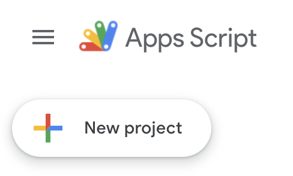

# Google Calendar Scripts

This repository contains some scripts the can be used in connection with [Google Calendar](https://calendar.google.com/). All scripts require read/write access to your Google Calendar and run on the [Google Apps Script](https://script.google.com/) platform.

## Warning

The scripts delete/modify your Google Calendar. If this causes any damage, you are responsible.

## Script Overview

### Delete (All) Meetings Script

The script [deleteMeetings.gs](./deleteMeetings.gs) can be used to remove all calendar entries with more than a certain number of participants. This script was inspired by a [news article about Shopify](https://www.bloomberg.com/news/articles/2023-01-03/shopify-ceo-tobi-lutke-tells-employees-to-just-say-no-to-meetings) that explained how and why Shopify deleted all their meetings at the beginning of 2023.

The time range for which to delete meetings can be customized in the script.

### Annotate Meeting Costs Script

The script [annotateMeetingCosts.gs](./annotateMeetingCosts.gs) can be used to annotate estimated costs for all calendar entries with more than a certain number of participants. It was inspired by many people who noticed that making the costs of a meeting visible would be usefule. Showing the costs can help to judge which meetings are needed and which are just too expensive considering the value they create.

The script annotates the costs of a meeting based on the number of participants, the length of the meeting and the average costs per employee and hours. It annotates all meetings within the next 7 days. So in order to annotate new meetings regularly it should be scheduled at least once per week.

## Installing/Using the Scripts

To use the scripts, go to [Google Apps Script](https://script.google.com/) and log in with your Google (Workspace) Account. The scripts should also work for private Google Accounts, but they are primary intended for businesses.

### Create a new Apps Script project

In order to import the scripts, you need to create a new project:

Your project should then look something like this:

After creating the project, give it a nice recognizable name.

Since you want the scripts to have access to your Google Calendar, you need to add `Google Calendar API` as a service to the project:

Once this is done, all you need to do is to copy&paste one of the scripts to the code Window, select the function to run and click `Run`.

If you want to run the script periodically, you can add a Trigger to do so:

Have fun!
